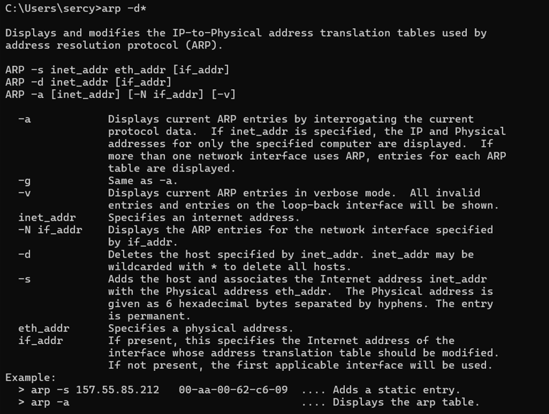
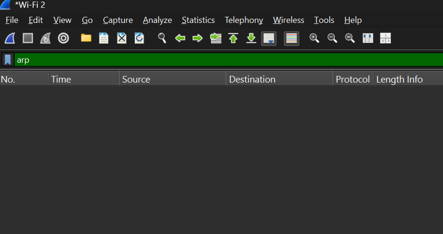
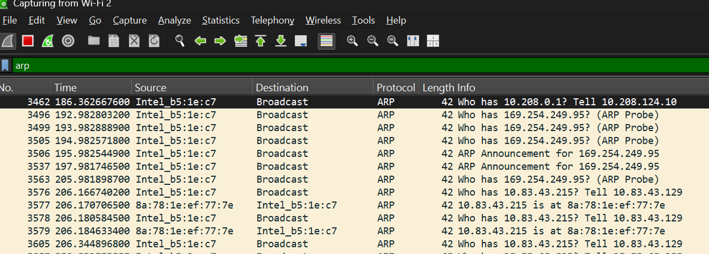
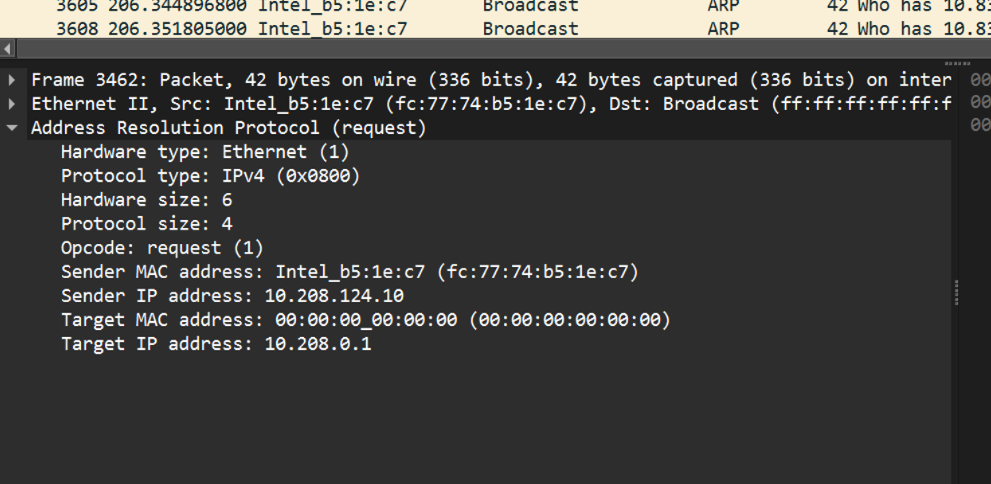

## Arya Bariq Irawan - 103072400132 - IF0405
# MODUL 13 ARP
## ARP
Address Resolution Protocol (ARP) adalah mekanisme dalam jaringan komputer yang digunakan untuk mencari dan mencocokkan alamat MAC berdasarkan alamat IP yang diketahui. ARP berperan penting dalam jaringan LAN karena perangkat harus mengetahui MAC Address tujuan agar dapat mengirimkan data pada lapisan Data Link, meskipun identifikasi perangkat biasanya dilakukan menggunakan alamat IP.

## Konsep ARP
ARP merupakan protokol yang berperan pada perbatasan Layer 2 dan Layer 3 OSI. Melalui ARP, perangkat dapat menemukan alamat MAC yang terkait dengan sebuah alamat IP, sehingga pengiriman data antar perangkat dalam jaringan lokal dapat dilakukan secara akurat dan efisien.

## Cara Kerja ARP
1. Perangkat akan mengirim data ke suatu alamat IP dalam jaringan lokal.
2. Perangkat memeriksa **ARP Cache** untuk mencari MAC Address yang sesuai.
3. Jika tidak ditemukan, perangkat mengirim **ARP Request** secara broadcast.
4. Perangkat yang memiliki IP tersebut mengirim **ARP Reply** berisi MAC Address-nya.
5. Informasi IP dan MAC Address disimpan ke **ARP Cache**.
6. Data kemudian dikirim menggunakan MAC Address tujuan yang telah diketahui.

## Analisis ARP pada Wireshark
1. Buka CMD sebagai Administrator, lalu jalankan perintah arp -d * untuk menghapus semua data yang tersimpan di ARP Cache. Setelah itu, komputer akan melakukan proses ARP lagi saat ingin berkomunikasi dengan perangkat lain di jaringan.

2. Membuka Wireshark lalu memilih Analyze -> Enabled Protocols -> IPv4

3. Start capture Wireshark
4. Membuka browser dan mengakses: http://gaia.cs.umass.edu/wireshark-labs/HTTP-ethereal-lab-file3.html
5. Stop capture Wireshark
6. Ketik filter: arp

7. Pilih salah satu paket untuk dianalisis

**Analisis Paket**
Berdasarkan hasil capture Wireshark, paket yang dipilih merupakan ARP Request (Opcode = Request/1). Perangkat dengan IP 10.208.124.10 dan MAC Address a2:31:3d:5b:6c:5d mengirimkan permintaan untuk mengetahui MAC Address dari perangkat yang memiliki IP 10.208.124.10 Karena alamat MAC tujuan belum diketahui, Target MAC Address masih bernilai 00:00:00:00:00:00. Oleh karena itu, paket ARP dikirim ke alamat Broadcast (ff:ff:ff:ff:ff:ff) agar diterima oleh seluruh perangkat dalam jaringan lokal. Pesan yang dikirim dapat diartikan sebagai "Siapa yang memiliki IP 10.208.124.10? Beri tahu 10.208.124.10" Dari hasil tersebut dapat disimpulkan bahwa protokol ARP digunakan untuk mencari dan mencocokkan alamat MAC Address berdasarkan IP Address sehingga perangkat dapat berkomunikasi dengan benar dalam jaringan lokal.
